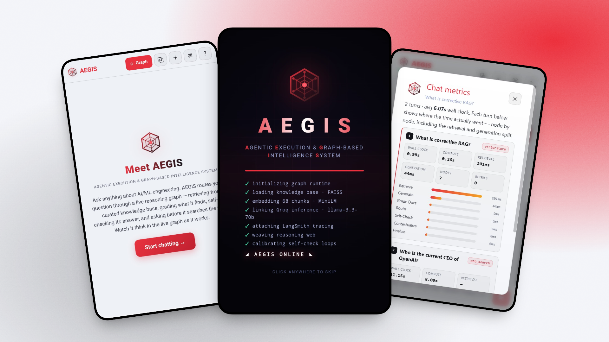
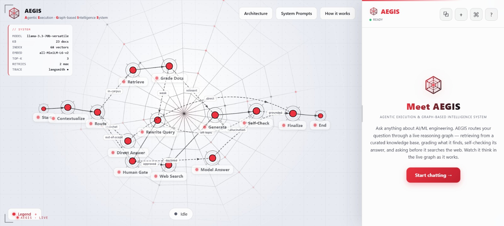
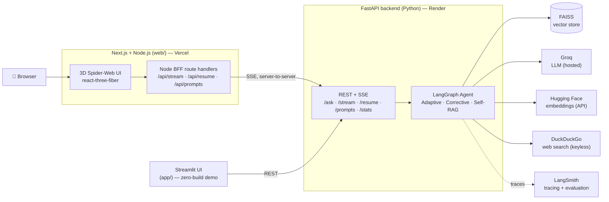
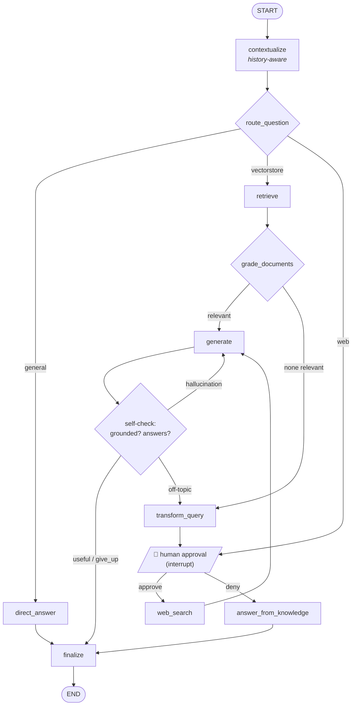
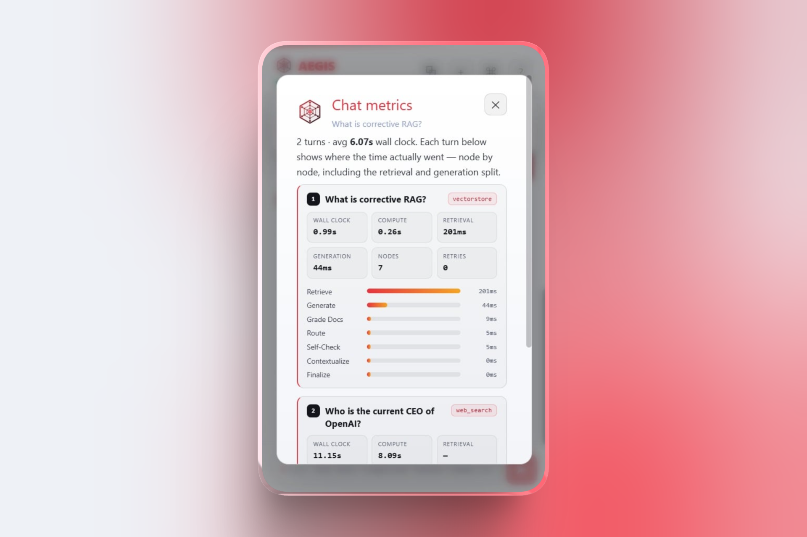

<div align="center">

# 🕸️ AEGIS — *Agentic Execution & Graph-based Intelligence System*

**An adaptive, self-correcting Retrieval-Augmented Generation agent — its reasoning graph visualized as a living 3D web.**

  <div align="center">
    
    <br>
  </div>

Built with **LangChain · LangGraph · LangSmith**, served by **FastAPI**, and fronted by an interactive **Next.js + Node.js** Three.js UI that lights up the agent's reasoning graph in real time.


[](https://github.com/SaadH-077/aegis-agentic-rag/actions/workflows/ci.yml)


### [🔴 **Live demo**](https://aegis-agentic-rag.vercel.app/) · [Why](#-the-60-second-pitch) · [Feature tour](#-feature-tour) · [Architecture](#-system-architecture) · [Hallucination control](#-controlling-hallucination) · [Deploy](#%EF%B8%8F-deployment-free-tier) · [Quickstart](#-quickstart)

</div>

---

## 🌐 Live demo

### ▶️ **[Try it live → aegis-agentic-rag.vercel.app](https://aegis-agentic-rag.vercel.app/)**

[](https://aegis-agentic-rag.vercel.app/)
[](https://aegis-agentic-rag.onrender.com/docs)

<div align="center">
    
    <br>
  </div>

> **Ask it `What is corrective RAG?`** and watch the 3D graph light up node-by-node as the agent retrieves, grades, generates, and self-checks live. Then try **`Who is the current CEO of OpenAI?`** to see it route to the web and ask for your approval first (human-in-the-loop). Deployed end to end on **100% free tiers** — Vercel (frontend) + Render (backend) + Groq (LLM) + Hugging Face (embeddings).
>
> ⏳ *The backend sleeps after ~15 min idle (Render free tier), so the very first request may take ~50s to wake it — then it's fast. Deploy your own in ~10 minutes: see **[DEPLOY.md](DEPLOY.md)**.*

---

## 🎯 The 60-second pitch

Most "RAG demos" are a single LLM call with some context stuffed in. **This is the opposite.**

AEGIS is a **production-shaped agent** that implements three recognized advanced RAG patterns —
- **Adaptive RAG** — *route* each question (knowledge base vs. live web vs. direct reply),
- **Corrective RAG (CRAG)** — *grade* retrieval and fall back to web search when it's weak,
- **Self-RAG** — *check the answer* for hallucination **and** relevance, then loop to fix itself —

orchestrated as a stateful, cyclic **LangGraph** with **human-in-the-loop** approval, **persistent conversation memory**, and **per-node latency instrumentation**.

And because a LangGraph *is literally a web*, the flagship UI renders it as an **interactive 3D web whose nodes glow as the agent traverses them live**, streamed over Server-Sent Events.

> **Runs on free tiers end to end.** Hosted LLM (Groq) + embeddings over the Hugging Face API mean **no paid keys, no multi-GB model downloads, no GPU**. One env var swaps the LLM to Hugging Face or fully-local Ollama.

This repository is intentionally built to answer the questions a senior AI-engineering interviewer actually asks — *how do you control hallucination, what's your retrieval strategy, where's the system prompt, what happens when a step fails, how do you observe latency?* Each has a section below and a feature you can click in the UI.

---

## ✨ Feature tour

| | Feature | What it shows |
| --- | --- | --- |
| 🧭 | **Adaptive router** | Sends each question to the vector store, the live web, or a direct reply — not everything is a retrieval. |
| 🔎 | **Corrective retrieval** | Grades retrieved chunks; drops the irrelevant ones; rewrites the query and (with approval) searches the web if nothing survives. |
| 🛡️ | **Self-checking answers** | A groundedness grader and a relevance grader gate every answer; failures trigger a **bounded** regenerate/rewrite loop. |
| 🙋 | **Human-in-the-loop** | Pauses (`interrupt()`) for your approval **before** any web search; resumes with `Command(resume=…)`. |
| 🧠 | **Persistent memory** | LangGraph `SqliteSaver` checkpoints each conversation thread; follow-ups are contextualized into standalone questions. |
| 🕸️ | **Live 3D reasoning graph** | The real compiled graph, streamed node-by-node over SSE; nodes glow as they execute. Click any node to learn what it does. |
| ⏱️ | **Per-turn metrics** | Every answer records real per-node latency (retrieval vs. generation vs. grading), retry count, and node count — viewable per chat. |
| 🧑‍🚀 | **System Prompts viewer** | The actual persona + grounding rules + every grader prompt, pulled **live from the backend** — transparency, not screenshots. |
| 📑 | **Citations** | Every answer ships its sources (KB filenames or clickable web links). |
| 📱 | **Responsive** | Chat-first on mobile; the reasoning graph auto-reveals while searching, then reverts — with a user toggle. |
| 💬 | **Rich Markdown answers** | Headings, **bold**, ordered/unordered lists, code blocks, blockquotes, and clickable links. |

---

## 🛠️ What this demonstrates (skills map)

| Area | Demonstrated by |
| --- | --- |
| **LangGraph** | Stateful cyclic `StateGraph`, conditional edges, self-correction loops, `MemorySaver`/`SqliteSaver` checkpointing, `interrupt()` / `Command(resume=...)` human-in-the-loop, node-by-node streaming |
| **LangChain** | LCEL chains (`prompt \| llm \| parser`), prompt templates, retrievers, `PydanticOutputParser` structured output, document loaders + recursive splitting, provider-agnostic `BaseChatModel` |
| **LangSmith** | End-to-end tracing, a curated evaluation **dataset**, **LLM-as-judge** evaluators (correctness / groundedness / relevance), experiment runner |
| **RAG engineering** | FAISS vector store, chunking strategy, document relevance grading, query rewriting, corrective web-search fallback, citations |
| **Hallucination control** | Context-constrained generation **+** a groundedness grader **+** a relevance grader **+** bounded retry loops (see [Controlling hallucination](#-controlling-hallucination)) |
| **Observability / latency** | **Per-node wall-clock timing** on every answer, retry counter, node count, an in-UI metrics viewer; LangSmith traces |
| **LLM ops / pragmatism** | Provider abstraction (Groq/HF/Ollama), in-memory LLM cache, bounded retries, prompt-engineered JSON (portable across open models that lack reliable tool-calling), free-tier cost awareness |
| **Backend** | FastAPI REST + **SSE streaming**, dependency injection, Pydantic schemas, OpenAPI docs |
| **Frontend** | **Next.js (App Router) + TypeScript**, **react-three-fiber / Three.js** 3D, Tailwind, a **Node.js BFF** that proxies/streams to the Python backend, dependency-free Markdown rendering, responsive mobile |
| **Engineering hygiene** | Typed config, **28 offline tests** (graph, chains, API, schemas), **ruff** lint, **GitHub Actions CI**, **Docker Compose**, one-click **Render + Vercel** deploy, clean module structure |

---

## 🧭 System architecture



The browser talks **only** to the Vercel BFF; the BFF proxies to Render server-side, so API keys never reach the client and there is no CORS surface.

## 🕸️ The agent graph (what the 3D web visualizes)



Node ids in [`web/lib/graphTopology.ts`](web/lib/graphTopology.ts) match the backend node names **exactly**, so streamed events map straight onto the 3D scene.

---

## 🛡️ Controlling hallucination

Hallucination control is **layered**, not a single trick:

1. **Constrained generation.** The answer prompt is hard-bound to the retrieved context — *"Use only facts present in the context. If the context is insufficient, say so; do NOT invent facts, figures, or APIs."* (Read it live in the **System Prompts** viewer.)
2. **Groundedness grader (Self-RAG).** After generation, a dedicated grader checks the answer is *supported by* the retrieved facts. If not, the graph loops back to `generate` instead of replying.
3. **Relevance grader.** A second grader checks the answer actually *resolves the question*; if not, the query is rewritten and retrieval is retried.
4. **Corrective retrieval (CRAG).** Retrieved docs are graded *before* generation; irrelevant ones are dropped, and if nothing survives the agent rewrites the query and (with approval) falls back to live web search rather than answering from thin air.
5. **Bounded loops.** A `MAX_RETRIES` counter guarantees termination; graders default to safe values on parse failure, so a malformed LLM response degrades gracefully instead of crashing or looping forever.
6. **Citations.** Every answer ships the exact sources (KB filenames or web URLs) behind it, so claims are auditable.

## 🧑‍🚀 System prompt & persona

There's a real system prompt for **every reasoning step**, not one hidden string. The **persona** (identity, tone, capabilities) lives in the `direct_answer` prompt; the **grounding rules** live in the `generation` prompt; routing, grading, and rewriting each have their own. They're all in [`src/agentic_rag/prompts.py`](src/agentic_rag/prompts.py) and exposed at runtime via `GET /prompts` and the in-app **System Prompts** viewer — the source of truth, not a copy.

## ⏱️ Latency & observability

Every node is wrapped with wall-clock instrumentation ([`graph/build.py`](src/agentic_rag/graph/build.py) → `_timed`), so each answer carries a **per-node latency trace** — how long retrieval, generation, and each grader actually took, plus the node count and how many self-correction retries ran. The UI stores this per chat and surfaces it in a **metrics viewer** (open the *Sessions* list → **metrics**):

```
performance · 2.57s compute · 1093ms retrieval
  retrieve         ███████████████████  1093ms
  grade_documents  █████████             497ms
  generate         ██████                350ms
  grade_generation █████                 318ms
  route_question   █████                 309ms
```

<div align="center">
    
    <br>
  </div>

`GET /stats` exposes the system config (model, vector count, top-k, retry budget). For full request tracing across every LLM call, set `LANGSMITH_TRACING=true`.

## 📱 Responsive (mobile)

On phones the layout is **chat-first** — the chat fills the screen, and the human-in-the-loop approval always appears right in the chat (never hidden). A live status strip shows what the agent is doing (*Retrieving… / Generating…*), and a **Graph** button opens the reasoning web as a full-screen, fully navigable modal (orbit · two-finger pan · pinch-zoom) that you dismiss to return to chat. Conversations are saved in the browser, so they survive backend restarts and reloads until you delete them.

---

## 🚀 Quickstart

You need a free **Groq key** (<https://console.groq.com/keys>) and a free **Hugging Face token** (<https://huggingface.co/settings/tokens>, role *read*, used for embeddings). LangSmith is optional.

### Option A — Local

**1. Backend (Python 3.10+)**

```bash
python -m venv .venv && source .venv/bin/activate   # Windows: .venv\Scripts\activate
pip install -e ".[dev]"

cp .env.example .env        # set LLM_PROVIDER=groq, GROQ_API_KEY=…, HF_TOKEN=…

python -m agentic_rag.ingest                         # build the FAISS index (already committed)
uvicorn agentic_rag.api.main:app --reload --port 8000
# API docs: http://localhost:8000/docs
```

**2a. Flagship 3D UI (Next.js + Node.js)**

```bash
cd web
cp .env.local.example .env.local     # BACKEND_URL=http://localhost:8000
npm install
npm run dev                          # http://localhost:3000
```

**2b. …or the zero-build Streamlit UI**

```bash
streamlit run app/streamlit_app.py   # http://localhost:8501
```

### Option B — Docker (everything at once)

```bash
cp .env.example .env                                  # add GROQ_API_KEY + HF_TOKEN
docker compose --profile tools run --rm ingest        # build the index once
docker compose up --build
#  Next.js 3D UI -> http://localhost:3000
#  Streamlit UI  -> http://localhost:8501
#  FastAPI docs  -> http://localhost:8000/docs
```

---

## ☁️ Deployment (free tier)

Two services, both free: **Render** (FastAPI backend) + **Vercel** (Next.js frontend). The included [`render.yaml`](render.yaml) Blueprint makes the backend one-click, and the FAISS index is committed so there's no build-time embedding step.

👉 **Full step-by-step guide: [DEPLOY.md](DEPLOY.md)** (≈10 minutes).

In short:
1. Push this repo to GitHub.
2. Render → **New → Blueprint** → pick the repo → paste `GROQ_API_KEY` + `HF_TOKEN`.
3. Vercel → **Import** the repo → set **Root Directory = `web`** → set `BACKEND_URL` to your Render URL.

---

## ⚙️ Configuration

All via `.env` (see [`.env.example`](.env.example)). Highlights:

| Variable | Default | Notes |
| --- | --- | --- |
| `LLM_PROVIDER` | `huggingface` | `groq` (recommended) \| `huggingface` \| `ollama` |
| `GROQ_API_KEY` | — | free key from console.groq.com (when `LLM_PROVIDER=groq`) |
| `GROQ_MODEL` | `llama-3.3-70b-versatile` | any Groq-served model |
| `HF_TOKEN` | — | free Hugging Face token (used for API embeddings) |
| `EMBEDDINGS_MODE` | `api` | `api` (no download) or `local` (sentence-transformers) |
| `RETRIEVER_K` | `3` | retrieved chunks per query |
| `MAX_RETRIES` | `2` | self-correction loop bound |
| `REQUIRE_WEB_SEARCH_APPROVAL` | `true` | the human-in-the-loop gate |
| `LANGSMITH_TRACING` | `false` | set `true` + `LANGSMITH_API_KEY` to trace |

> The provider abstraction lives in [`src/agentic_rag/llm.py`](src/agentic_rag/llm.py) — Groq ↔ Hugging Face ↔ Ollama is a one-line change.

---

## 🔬 Evaluation (LangSmith)

```bash
# in .env: LANGSMITH_TRACING=true and LANGSMITH_API_KEY=...
python eval/run_eval.py
```

Creates/updates a LangSmith dataset of QA pairs grounded in the corpus, runs the agent over each, and scores outputs with three **LLM-as-judge** evaluators — **correctness** (vs. reference), **groundedness** (supported by retrieved context), and **relevance** (answers the question). Results appear as a comparable experiment in LangSmith. See [`eval/`](eval/).

---

## 🧪 Testing & CI

```bash
pytest          # 28 tests, fully offline (mocked LLM/retriever/web) — no keys needed
ruff check .    # lint
```

The suite drives the **real compiled LangGraph** with deterministic fakes to assert routing, the corrective web fallback, the HITL interrupt/resume, self-correction termination, conversation memory, streaming, and every API endpoint. [GitHub Actions](.github/workflows/ci.yml) runs lint + tests on every push.

---

## 📁 Project structure

```
agentic-rag-assistant/
├── src/agentic_rag/
│   ├── config.py          # typed env settings (pydantic-settings)
│   ├── llm.py             # provider factory (Groq / HF / Ollama)
│   ├── embeddings.py      # API or local embeddings
│   ├── chains.py          # LCEL chains (router, graders, generator, rewriter)
│   ├── prompts.py         # all prompt templates + the /prompts catalog
│   ├── schemas.py         # Pydantic structured-output schemas
│   ├── vectorstore.py     # FAISS build/load
│   ├── ingest.py          # load → split → embed → persist
│   ├── tools/web_search.py
│   ├── graph/             # ← the LangGraph agent (state, nodes, edges, HITL, timing)
│   └── api/               # FastAPI app (REST + SSE + /prompts + /stats)
├── app/streamlit_app.py   # zero-build UI
├── web/                   # Next.js + Node.js + react-three-fiber 3D UI
│   ├── app/               #   App Router pages + BFF route handlers
│   ├── components/        #   ChatPanel, 3D graph, MetricsPanel, PromptsPanel, MobileGraph…
│   └── lib/               #   useAgent hook, graph topology, types
├── data/corpus/           # 23 AI/ML knowledge-base documents
├── storage/faiss_index/   # prebuilt FAISS index (committed; ~164 KB)
├── eval/                  # LangSmith dataset + evaluators + runner
├── tests/                 # offline pytest suite
├── render.yaml            # Render Blueprint (backend)
├── DEPLOY.md              # free-tier deployment guide
├── docker-compose.yml     # api + streamlit + web + ingest
└── Dockerfile
```

---

## 🧠 Notable design decisions

- **Prompt-engineered JSON over native tool-calling.** Open-weight models on free inference don't reliably implement OpenAI-style tool-calling, so structured steps use `PydanticOutputParser` with safe fallbacks — portable and robust. ([chains.py](src/agentic_rag/chains.py))
- **API embeddings by default.** Keeps the install lean (no `torch`, no gigabytes of disk) — a deliberate response to a real constraint, and the thing that makes free-tier deployment viable. Local embeddings are a one-flag opt-in.
- **Provider abstraction.** Everything downstream is provider-agnostic (`BaseChatModel`), so Groq ↔ HF ↔ Ollama is a config change.
- **Bounded self-correction.** A retry counter guarantees termination; graders default to safe values on parse failure so a malformed LLM response never crashes the graph.
- **The graph as the UI.** Streamed node events map 1:1 onto the 3D scene because the ids match the backend exactly.
- **Observability built in, not bolted on.** Each node is wrapped with a timing decorator at graph-build time, so per-node latency, retry counts, and the full traversal ship with every answer — no separate profiling pass.
- **BFF, not direct calls.** The browser hits Vercel's own routes; the Node BFF proxies to the backend server-side — keys stay server-side and there's no CORS surface.

---

## 🗺️ Roadmap

- Re-ranking + hybrid (BM25 + dense) retrieval
- Persist checkpoints to managed Postgres for cross-restart memory in production
- Multi-agent supervisor variant
- RAGAS metrics alongside the LLM-judge evaluators

---

## 📄 License

MIT © Saad Haroon Jehangir — see [LICENSE](LICENSE).

<div align="center"><sub>Built to show applied mastery of LangChain, LangGraph, and LangSmith — not just to call an LLM.</sub></div>
